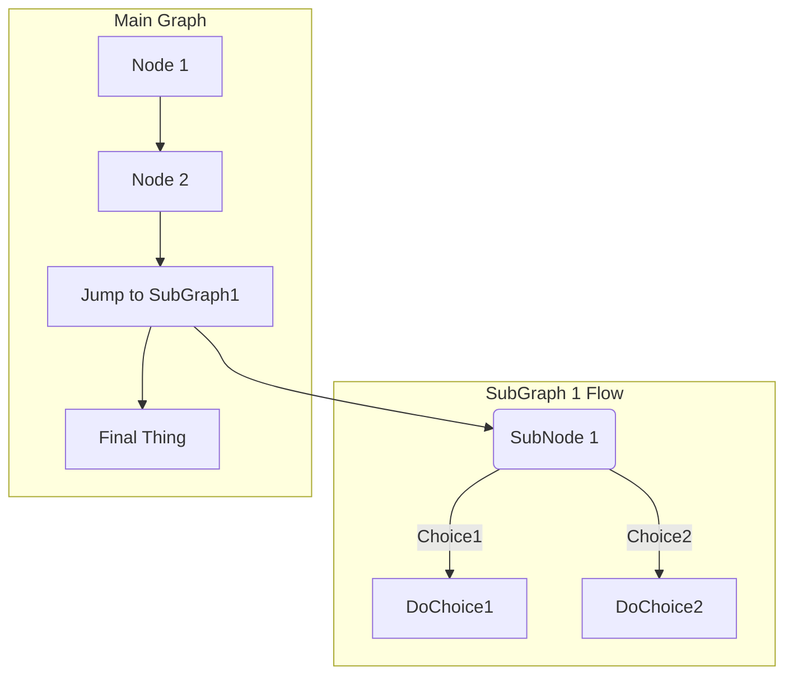

Gitlab
======

TODO: Podaj wybrane funkcjonalności serwisu GitLab

GitLab 

GitLab Flavored Markdown (GLFM) (FREE ALL)
The abbreviation changed from GFM to GLFM in GitLab 14.10.

When you enter text in the GitLab UI, GitLab assumes the text is in the Markdown language. The text is rendered with a set of styles. These styles are called GitLab Flavored Markdown.

For example, in Markdown, an unordered list looks like this:

- Cat
- Dog
- Turtle
When this list is rendered, it looks like this:

Cat
Dog
Turtle
These styles are valid for GitLab only. The GitLab documentation website and the main GitLab website use Kramdown instead.

You should not view this page in the documentation, but instead view these styles as they appear on GitLab.

GitLab Flavored Markdown extends the CommonMark specification. It was inspired by GitHub Flavored Markdown.

Where you can use GitLab Flavored Markdown
You can use GitLab Flavored Markdown in the following areas:

Comments
Issues
Merge requests
Milestones
Snippets (the snippet must be named with a .md extension)
Wiki pages
Markdown documents inside repositories
Epics
You can also use other rich text files in GitLab. You might have to install a dependency to do so. For more information, see the gitlab-markup gem project.

Differences between GitLab Flavored Markdown and standard Markdown
GitLab uses standard CommonMark formatting. However, GitLab Flavored Markdown extends standard Markdown with features made specifically for GitLab.

Features not found in standard Markdown:

Color chips written in HEX, RGB or HSL
Diagrams and flowcharts
Emoji
Front matter
Inline diffs
Math equations and symbols written in LaTeX
Task Lists
Table of Contents
Wiki specific Markdown
Features extended from standard Markdown:

Standard Markdown	Extended Markdown in GitLab
blockquotes	multi-line blockquotes
code blocks	colored code and syntax highlighting
emphasis	multiple underscores in words
headers	linkable Header IDs
images	embedded videos and audio
line breaks	more line break control
links	automatically linking URLs
Features not found in standard Markdown
The following features are not found in standard Markdown.

Colors
Markdown does not support changing text color.

You can write a color code in the formats: HEX, RGB, or HSL.

HEX: `#RGB[A]` or `#RRGGBB[AA]`
RGB: `RGB[A](R, G, B[, A])`
HSL: `HSL[A](H, S, L[, A])`
Named colors are not supported.

In the GitLab application (but not the GitLab documentation) color codes in backticks display a color chip next to the color code. For example:

- `#F00`
- `#F00A`
- `#FF0000`
- `#FF0000AA`
- `RGB(0,255,0)`
- `RGB(0%,100%,0%)`
- `RGBA(0,255,0,0.3)`
- `HSL(540,70%,50%)`
- `HSLA(540,70%,50%,0.3)`
View this topic in GitLab to see the color chips next to the color code:

#F00
#F00A
#FF0000
#FF0000AA
RGB(0,255,0)
RGB(0%,100%,0%)
RGBA(0,255,0,0.3)
HSL(540,70%,50%)
HSLA(540,70%,50%,0.3)
Diagrams and flowcharts
You can generate diagrams from text by using:

Mermaid
PlantUML
Kroki to create a wide variety of diagrams.
In wikis, you can also add and edit diagrams created with the diagrams.net editor.

Mermaid
Visit the official page for more details. The Mermaid Live Editor helps you learn Mermaid and debug issues in your Mermaid code. Use it to identify and resolve issues in your diagrams.

To generate a diagram or flowchart, write your text inside the mermaid block:

graph TD;
  A-->B;
  A-->C;
  B-->D;
  C-->D;
You can also include subgraphs:

graph TB

  SubGraph1 --> SubGraph1Flow
  subgraph "SubGraph 1 Flow"
  SubGraph1Flow(SubNode 1)
  SubGraph1Flow -- Choice1 --> DoChoice1
  SubGraph1Flow -- Choice2 --> DoChoice2
  end

  subgraph "Main Graph"
  Node1[Node 1] --> Node2[Node 2]
  Node2 --> SubGraph1[Jump to SubGraph1]
  SubGraph1 --> FinalThing[Final Thing]
end
PlantUML
PlantUML integration is enabled on GitLab.com. To make PlantUML available in self-managed installation of GitLab, a GitLab administrator must enable it.

Kroki
To make Kroki available in GitLab, a GitLab administrator must enable it. For more information, see the Kroki integration page.

Emoji
View this topic in GitLab.

::Tabs

:::TabTitle Rendered Markdown

Sometimes you want to  around a bit and add some  to your . Well we have a gift for you:

You can use emoji anywhere GitLab Flavored Markdown is supported. 

You can use it to point out a  or warn about  patches. If someone improves your really  code, send them some . People  you for that.

If you're new to this, don't be . You can join the emoji . Just look up one of the supported codes.

Consult the Emoji Cheat Sheet for a list of all supported emoji codes. 

:::TabTitle Code

Sometimes you want to :monkey: around a bit and add some :star2: to your
:speech_balloon:. Well we have a gift for you:

:zap: You can use emoji anywhere GitLab Flavored Markdown is supported. :v:

You can use it to point out a :bug: or warn about :speak_no_evil: patches.
And if someone improves your really :snail: code, send them some :birthday:.
People :heart: you for that.

If you're new to this, don't be :fearful:. You can join the emoji :family:.
Just look up one of the supported codes.

Consult the [Emoji Cheat Sheet](https://www.webfx.com/tools/emoji-cheat-sheet/)
for a list of all supported emoji codes. :thumbsup:
::EndTabs

Emoji and your operating system
The previous emoji example uses hard-coded images. Rendered emoji in GitLab may be different depending on the OS and browser used.

Most emoji are natively supported on macOS, Windows, iOS, Android, and fall back on image-based emoji where there is no support.

On Linux, you can download Noto Color Emoji to get full native emoji support. Ubuntu 18.04 (like many modern Linux distributions) has this font installed by default.

To learn more about adding custom emoji, see Custom emoji.

Front matter
Front matter is metadata included at the beginning of a Markdown document, preceding the content. This data can be used by static site generators like Jekyll, Hugo, and many other applications.

When you view a Markdown file rendered by GitLab, front matter is displayed as-is, in a box at the top of the document. The HTML content displays after the front matter. To view an example, you can toggle between the source and rendered version of a GitLab documentation file.

In GitLab, front matter is used only in Markdown files and wiki pages, not the other places where Markdown formatting is supported. It must be at the very top of the document and must be between delimiters.

The following delimiters are supported:

YAML (---):

---
title: About Front Matter
example:
  language: yaml
---
TOML (+++):

+++
title = "About Front Matter"
[example]
language = "toml"
+++
JSON (;;;):

;;;
{
  "title": "About Front Matter"
  "example": {
    "language": "json"
  }
}
;;;
Other languages are supported by adding a specifier to any of the existing delimiters. For example:

---php
$title = "About Front Matter";
$example = array(
  'language' => "php",
);
---
Inline diff
View this topic in GitLab.

With inline diff tags, you can display {+ additions +} or [- deletions -].

The wrapping tags can be either curly braces or square brackets:

- {+ addition 1 +}
- [+ addition 2 +]
- {- deletion 3 -}
- [- deletion 4 -]
